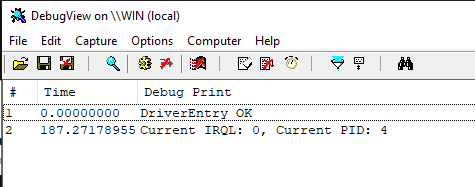

# ExpWorkerThreadTest
## Exercise
Explain how we were able to determine that `ExpWorkerThread` is the system thread responsible for dequeueing work items and executing them. Hint: The fastest way is to write a driver.

## Run
```
sc create ExpWorkerThreadTest  type=kernel binPath=<path to the .sys>
sc start ExpWorkerThreadTest 
```

## Result


PID of 4 means it's a system thread.
